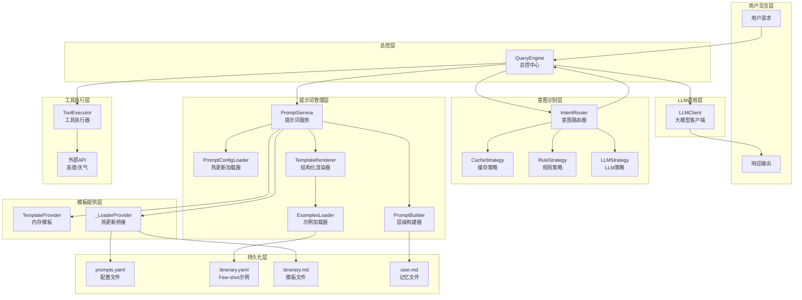
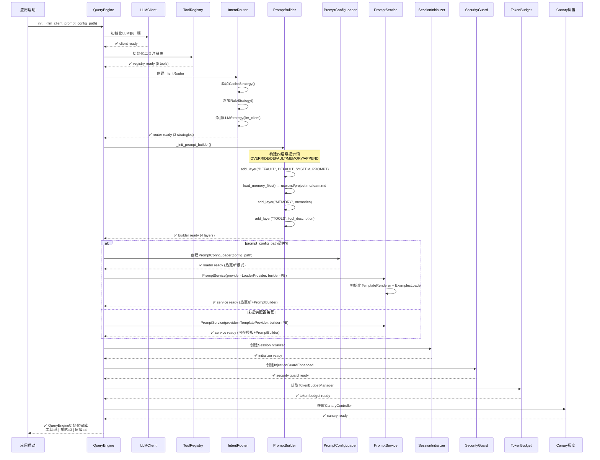
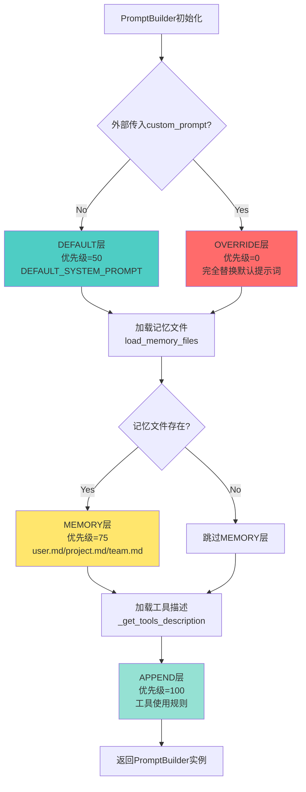
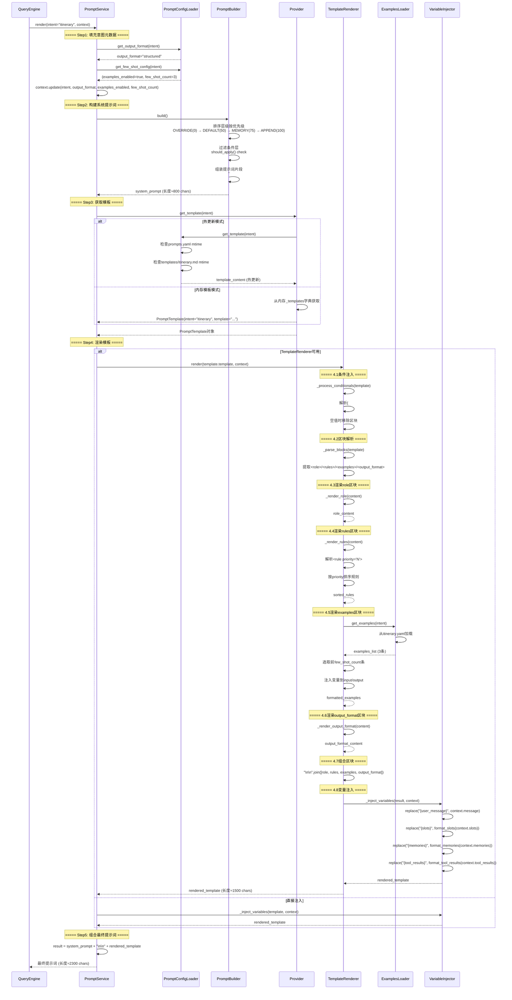
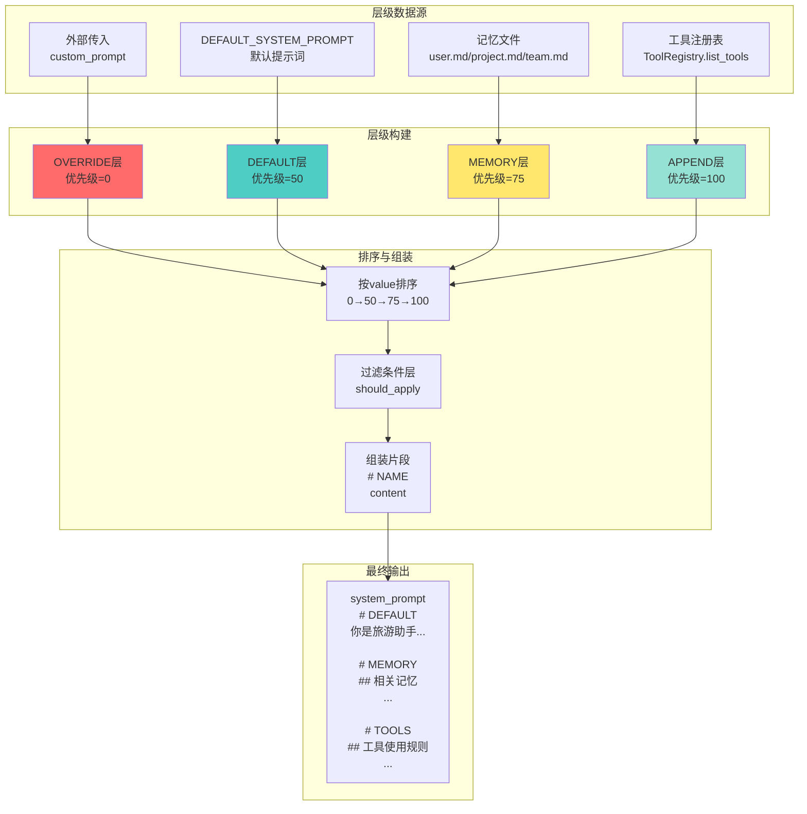
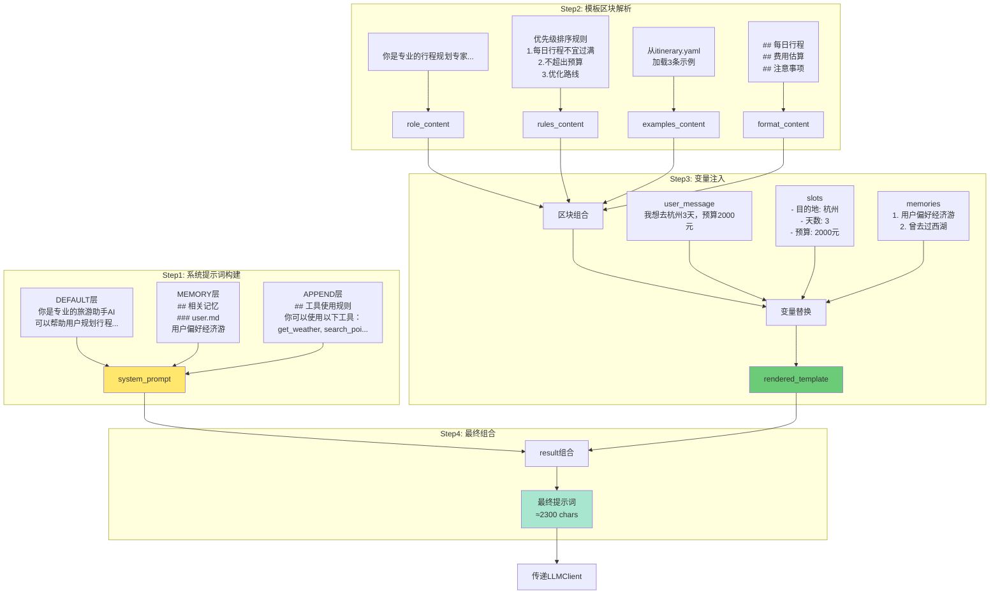

# 提示词模板管道完整工作流程图

> 本文档详细讲解 Travel Assistant 项目提示词模板管道架构的完整工作流程

---

## 📋 目录

1. [整体架构概览](#1-整体架构概览)
2. [初始化阶段流程](#2-初始化阶段流程)
3. [运行时处理流程](#3-运行时处理流程)
4. [提示词渲染核心流程](#4-提示词渲染核心流程)
5. [热更新检测机制](#5-热更新检测机制)
6. [数据流转示意图](#6-数据流转示意图)
7. [实际渲染示例](#7-实际渲染示例)

---

## 1. 整体架构概览

### 核心组件关系图



### 四层架构说明

| 层级 | 组件 | 职责 | 关键特性 |
|------|------|------|----------|
| **用户交互层** | QueryEngine.process() | 接收请求、流式响应 | 并发控制、会话隔离 |
| **意图识别层** | IntentRouter + 3策略 | 识别用户意图类型 | Cache/Rule/LLM三级策略 |
| **提示词管理层** | PromptService + 5子组件 | 提示词渲染与组装 | 热更新、结构化、Few-shot |
| **模板提供层** | Provider接口 | 模板查询与缓存 | 版本控制、优雅降级 |

---

## 2. 初始化阶段流程

### QueryEngine初始化序列



### PromptBuilder四层组装详解



### 四层优先级说明

| 层级 | 优先级 | 作用时机 | 典型用途 |
|------|--------|----------|----------|
| **OVERRIDE** | 0 | 最高优先，最先应用 | 测试/调试时完全替换 |
| **DEFAULT** | 50 | 标准层，基础角色定义 | 系统提示词模板 |
| **MEMORY** | 75 | 记忆层，注入历史偏好 | CLAUDE.md等记忆文件 |
| **APPEND** | 100 | 总是追加到最后 | 工具描述、动态规则 |

**注意**: 数字越小优先级越高(越后应用)，最终构建顺序为 `OVERRIDE → DEFAULT → MEMORY → APPEND`

---

## 3. 运行时处理流程

### 用户请求完整处理流程

```mermaid
sequenceDiagram
    participant U as 用户
    participant QE as QueryEngine
    participant SEM as Semaphore并发锁
    participant SL as SessionLock互斥锁
    participant AUTH as AuthManager
    participant CY as Canary灰度
    participant INIT as SessionInitializer
    participant P2 as Phase2持久化
    participant EVAL as Eval评估
    participant IR as IntentRouter
    participant RC as RequestContext
    participant PS as PromptService
    participant LLM as LLMClient
    participant TE as ToolExecutor
    
    U->>QE: process(user_input, conv_id, user_id)
    
    Note over QE: ===== UC3-2并发控制 =====
    QE->>SEM: acquire() 最大并发100
    SEM-->>QE: ✅ 信号量获取成功
    
    Note over QE: ===== UC3-1会话隔离 =====
    QE->>SL: 获取session_lock(conv_id)
    QE->>SL: acquire() 同一会话串行化
    SL-->>QE: ✅ 会话锁获取成功
    
    Note over QE: ===== UC4-1越权校验 =====
    QE->>AUTH: validate_access(conv_id, user_id)
    AUTH-->>QE: ✅ 权限验证通过
    
    Note over QE: ===== 灰度版本决策 =====
    QE->>CY: decide_version(user_id)
    CY-->>QE: canary_result (is_canary=true/false)
    
    Note over QE: ===== Step0: 会话初始化 =====
    alt conv_id首次访问
        QE->>INIT: initialize(conv_id, user_id)
        INIT-->>QE: session_state (context_window=16000)
        QE->>QE: 标记initialized_sessions.add(conv_id)
    end
    
    Note over QE: ===== Phase2持久化初始化 =====
    QE->>P2: ensure_phase2_initialized()
    P2-->>QE: ✅ Redis/DB连接池就绪
    
    Note over QE: ===== EVAL评估钩子 =====
    QE->>EVAL: ensure_eval_initialized()
    EVAL-->>QE: ✅ 评估collector就绪
    
    Note over QE: ===== 主循环最多5次重试 =====
    loop retry_count < 5
        try
            Note over QE: ===== Step1: 意图识别 =====
            QE->>IR: classify(user_input, history)
            IR-->>QE: IntentResult(intent="itinerary", confidence=0.95)
            
            Note over QE: ===== Step2: 上下文构建 =====
            QE->>RC: 创建RequestContext
            QE->>RC: 填充message/user_id/conv_id
            QE->>RC: 填充slots/history/memories
            QE->>RC: 填充intent/output_format/few_shot_config
            RC-->>QE: ✅ context ready
            
            Note over QE: ===== Step3: 提示词渲染 =====
            QE->>PS: render(intent="itinerary", context)
            PS-->>QE: 最终提示词 (长度≈2000 chars)
            
            Note over QE: ===== Step4: LLM调用 =====
            QE->>LLM: stream(messages=[提示词+用户消息])
            LLM-->>QE: 流式响应片段
            
            Note over QE: ===== Step5: 工具执行 =====
            alt 需要工具调用
                QE->>TE: execute_tool("search_poi", args)
                TE-->>QE: ToolResult(POI数据)
                QE->>RC: 更新context.tool_results
                QE->>PS: re-render(intent, updated_context)
                PS-->>QE: 新提示词(含工具结果)
                QE->>LLM: stream(messages=[新提示词])
                LLM-->>QE: 最终响应
            end
            
            QE-->>U: 流式返回完整响应
            return SUCCESS
        catch Exception
            QE->>QE: should_retry(exception)
            alt 可重试
                QE->>QE: apply_backoff(count)
                continue
            else 不可重试
                QE->>QE: get_fallback_response(exception)
                QE-->>U: 降级响应
                return FAILURE
            end
        end
    end
    
    Note over QE: ===== 清理阶段 =====
    QE->>SL: release()
    QE->>SEM: release()
```

### IntentRouter三级策略详解

```mermaid
graph TB
    A[IntentRouter.classify] --> B[CacheStrategy]
    
    B --> C{缓存命中?}
    C -->|Yes| D[返回缓存结果<br/>confidence=1.0<br/>method=cache]
    
    C -->|No| E[RuleStrategy]
    
    E --> F{关键词规则匹配}
    F -->|关键词匹配<br/>"规划行程/推荐" --> G[返回规则结果<br/>confidence=0.9<br/>method=rule]
    
    F -->|无规则命中 --> H[LLMStrategy]
    
    H --> I[构建LLM提示词]
    I --> J[调用LLM分类]
    J --> K[解析IntentResult<br/>confidence=0.85<br/>method=llm]
    
    D --> L[IntentResult<br/>intent="itinerary"]
    G --> L
    K --> L
    
    L --> M[返回QueryEngine]
    
    style D fill:#a8e6cf
    style G fill:#ffd93d
    style K fill:#6bcb77
```

### 策略优先级与性能对比

| 策略 | 响应时间 | 准确度 | 成本 | 适用场景 |
|------|---------|--------|------|----------|
| **CacheStrategy** | ~1ms | 100% | 0 | 重复请求快速响应 |
| **RuleStrategy** | ~5ms | 90% | 0 | 明确关键词意图 |
| **LLMStrategy** | ~200ms | 85% | API调用费 | 模糊/复杂意图 |

---

## 4. 提示词渲染核心流程

### PromptService.render详细流程



### TemplateRenderer区块解析详解

```mermaid
graph TB
    A[原始模板Markdown] --> B[第一步: 条件注入处理]
    
    B --> C{检测{#if var}}
    C -->|var非空 --> D[保留区块内容]
    C -->|var为空 --> E[移除整个区块]
    
    D --> F[第二步: 区块解析]
    E --> F
    
    F --> G[提取<role>区块]
    F --> H[提取<rules>区块]
    F --> I[提取<examples>区块]
    F --> J[提取<output_format>区块]
    
    G --> K[_render_role<br/>直接返回文本]
    
    H --> L[_render_rules<br/>解析<rule priority="N">]
    L --> M[按priority排序<br/>1→2→3→99]
    M --> N[格式化为列表<br/>- 规则1<br/>- 规则2]
    
    I --> O[_render_examples]
    O --> P[ExamplesLoader.get_examples]
    P --> Q[YAML加载示例列表]
    Q --> R[选取前few_shot_count条]
    R --> S[注入变量到input/output]
    S --> T[格式化为示例文本<br/>**示例1**: 用���... 助手...]
    
    J --> U[_render_output_format<br/>添加标题后返回]
    
    K --> V[第三步: 组合区块]
    N --> V
    T --> V
    U --> V
    
    V --> W["\n\n".join渲染结果]
    
    W --> X[第四步: 变量注入]
    X --> Y[替换{user_message}]
    X --> Z[替换{slots}<br/>format_slots函数]
    X --> AA[替换{memories}<br/>format_memories函数]
    X --> AB[替换{tool_results}<br/>format_tool_results函数]
    
    Y --> AC[最终渲染结果]
    Z --> AC
    AA --> AC
    AB --> AC
    
    style G fill:#a8e6cf
    style H fill:#ffd93d
    style I fill:#6bcb77
    style J fill:#4d96ff
```

### 变量格式化函数说明

| 函数 | 输入 | 输出格式 | 示例 |
|------|------|----------|------|
| **format_slots()** | SlotResult对象 | 无标题列表 | `- 目的地: 杭州<br/>- 天数: 3<br/>- 预算: 2000元` |
| **format_memories()** | List[MemoryItem] | 编号列表 | `1. 用户偏好经济游<br/>2. 曾去过西湖` |
| **format_tool_results()** | Dict[str, Any] | 工具名+JSON | `search_poi: {"name":"西湖","rating":4.8}` |

---

## 5. 热更新检测机制

### PromptConfigLoader双缓存机制

```mermaid
graph TB
    subgraph "配置缓存流程"
        A1[get_config调用] --> B1{should_reload_config?}
        B1 --> C1[读取prompts.yaml mtime]
        C1 --> D1{current_mtime > last_mtime?}
        D1 -->|Yes<br/>文件已修改 --> E1[重新加载YAML]
        D1 -->|No<br/>文件未变 --> F1[使用内存缓存<br/>self._cache]
        E1 --> G1[更新last_mtime]
        G1 --> H1[更新cache字典]
        H1 --> I1[返回配置Dict]
        F1 --> I1
    end
    
    subgraph "模板缓存流程"
        J1[get_template调用] --> K1{should_reload_template?}
        K1 --> L1[读取template.md mtime]
        L1 --> M1{current_mtime > cached_time?}
        M1 -->|Yes<br/>文件已修改 --> N1[重新读取文件]
        M1 -->|No<br/>文件未变 --> O1[使用template_cache<br/>self._template_cache]
        N1 --> P1[更新template_cache_time]
        P1 --> Q1[更新template_cache]
        Q1 --> R1[返回模板内容]
        O1 --> R1
    end
    
    S1[获取意图配置] --> A1
    I1 --> T1[获取template_path]
    T1 --> K1
    R1 --> U1[返回最终模板]
    
    style E1 fill:#ff6b6b
    style N1 fill:#ff6b6b
    style F1 fill:#a8e6cf
    style O1 fill:#a8e6cf
```

### 热更新检测时间线

```mermaid
gantt
    title 热更新检测时间线
    dateFormat X
    axisFormat %s秒
    
    section 初始化阶段
    加载YAML配置           :a1, 0, 1s
    记录last_mtime         :a2, after a1, 1s
    加载模板文件           :a3, after a2, 1s
    记录template_cache_time :a4, after a3, 1s
    
    section 运行时阶段
    用户请求1              :b1, 10, 1s
    检测配置mtime          :b2, after b1, 1ms
    检测模板mtime          :b3, after b2, 1ms
    使用缓存响应           :b4, after b3, 200ms
    
    section 修改阶段
    编辑prompts.yaml       :c1, 30, 5s
    mtime变化              :milestone, 35, 0s
    
    section 热更新生效
    用户请求2              :d1, 40, 1s
    检测配置mtime变化      :d2, after d1, 1ms
    重新加载YAML           :d3, after d2, 50ms
    更新cache              :d4, after d3, 1ms
    使用新配置响应          :d5, after d4, 200ms
```



### 文件修改时间检测原理

**关键技术**: `os.stat(file_path).st_mtime`

```python
# backend/app/core/prompts/loader.py:48-77

def _should_reload_config(self) -> bool:
    """检查配置文件是否被修改"""
    current_mtime = self.config_path.stat().st_mtime
    return current_mtime > self._last_mtime

def _should_reload_template(self, template_path: Path) -> bool:
    """检查模板文件是否被修改"""
    current_mtime = template_path.stat().st_mtime
    cached_time = self._template_cache_time.get(str(template_path), 0)
    return cached_time == 0 or current_mtime > cached_time
```

**优势**:
- ✅ 零轮询开销: 仅在请求时检测
- ✅ 精确到毫秒: 文件系统mtime精度
- ✅ 双缓存机制: 配置缓存+模板缓存独立管理

---

## 6. 数据流转示意图

### RequestContext数据流转

```mermaid
graph LR
    subgraph "输入数据"
        A[用户消息<br/>"我想去杭州3天"]
        B[用户ID<br/>user_123]
        C[会话ID<br/>conv_456]
    end
    
    subgraph "IntentRouter处理"
        D[IntentResult<br/>intent=itinerary<br/>confidence=0.95]
    end
    
    subgraph "SlotExtractor处理"
        E[SlotResult<br/>destination=杭州<br/>days=3<br/>budget=2000元]
    end
    
    subgraph "MemoryService处理"
        F[MemoryList<br/>1. 用户偏好经济游<br/>2. 曾去过西湖]
    end
    
    subgraph "ToolExecutor处理"
        G[ToolResults<br/>search_poi: {...}<br/>get_weather: {...}]
    end
    
    subgraph "RequestContext组装"
        H[RequestContext<br/>message<br/>slots<br/>memories<br/>tool_results<br/>intent<br/>output_format<br/>examples_enabled]
    end
    
    A --> D
    B --> H
    C --> H
    D --> E
    E --> H
    D --> F
    F --> H
    D --> G
    G --> H
    
    H --> I[PromptService.render]
    
    style H fill:#ffe66d
```

### PromptBuilder层级组装流程



### 最终提示词组合

```mermaid
graph TB
    A[system_prompt<br/>PromptBuilder构建] --> B[组合基础]
    
    C[rendered_template<br/>TemplateRenderer渲染] --> D[组合模板]
    
    B --> E[result = system_prompt + "\n\n" + rendered_template]
    D --> E
    
    E --> F[最终提示词<br/>长度≈2300 chars<br/>包含:<br/>- 角色定义<br/>- 记忆信息<br/>- 工具规则<br/>- 结构化模板<br/>- Few-shot示例<br/>- 用户变量]
    
    F --> G[传递给LLMClient]
    
    style F fill:#6bcb77
```

---

## 7. 实际渲染示例

### 示例场景: 行程规划请求

**用户输入**:
```
"我想去杭州3天，预算2000元"
```

**处理流程数据**

```yaml
# Step1: IntentRouter识别结果
intent: "itinerary"
confidence: 0.95
method: "rule"

# Step2: SlotExtractor提取结果
slots:
  destination: "杭州"
  days: 3
  budget: "2000元"

# Step3: MemoryService记忆结果
memories:
  - content: "用户偏好经济游"
  - content: "曾去过西湖"

# Step4: PromptConfigLoader配置
output_format: "structured"
examples_enabled: true
few_shot_count: 3

# Step5: RequestContext完整数据
message: "我想去杭州3天，预算2000元"
user_id: "user_123"
conversation_id: "conv_456"
intent: "itinerary"
```

### 渲染过程可视化



### 最终渲染输出

```markdown
# DEFAULT
你是一个专业的旅游助手AI，可以帮助用户：
1. 规划旅游行程
2. 推荐景点和活动
3. 提供天气和交通信息
4. 根据用户偏好给出建议

请使用友好、专业的语气与用户交流。

# MEMORY
## 相关记忆

以下是你之前了解到的相关信息，请结合这些内容回答：
### user.md
用户偏好经济游

# TOOLS
## 工具使用规则

你可以使用以下工具来获取实时信息：
get_weather, search_poi, get_hotel_info...

**重要：工具调用规则**
- 当需要获取实时数据时，必须通过 function calling 调用工具
- 不要编写Python代码调用工具
- 工具调用是透明的，系统会自动完成

---

你是专业的行程规划专家，擅长为用户设计个性化、高效的旅行行程。

**重要规则**：
- 每日行程不宜过满，留出充足休息时间
- 不提供超出用户预算的建议
- 考虑景点间地理位置，优化路线安排
- 包含具体时间、价格、游览时长

**示例1**：
用户：我想去杭州3天，预算2000元
助手：好的，为您规划杭州3日经济游，总预算2000元：

## 每日行程

### 第1天 - 西湖经典游
- 09:00 西湖断桥残雪（免费）
- 10:30 白堤漫步（免费）
- 12:00 知味观午餐（约50元）
...

**示例2**：
用户：带孩子去北京5天，想要寓教于乐
助手：为您推荐北京5日亲子游，兼顾教育与娱乐...

**示例3**：
用户：商务出差去上海2天，住在浦东机场附近
助手：为您安排上海2日商务行程...

## 当前请求

**用户需求**：我想去杭州3天，预算2000元

**提取要素**：
- 目的地: 杭州
- 天数: 3
- 预算档次: 2000元

**用户偏好**：
1. 用户偏好经济游

## 每日行程
- 时间、景点、时长、交通

## 费用估算
- 总计：XXX元

## 注意事项
- 开放时间
- 必备物品
```

### 工具调用后更新示例

**假设工具执行结果**:
```json
{
  "search_poi": {
    "西湖": {"rating": 4.8, "price": "免费"},
    "灵隐寺": {"rating": 4.7, "price": "75元"}
  },
  "get_weather": {
    "杭州": {"temp": "25°C", "condition": "晴"}
  }
}
```

**第二次渲染**:
```markdown
...

**查询结果**：
search_poi: {"西湖": {"rating": 4.8, "price": "免费"}, "灵隐寺": {...}}
get_weather: {"杭州": {"temp": "25°C", "condition": "晴"}}
...
```

---

## 📊 性能指标总结

| 阶段 | 平均耗时 | 主要开销 | 优化措施 |
|------|---------|---------|---------|
| **IntentRouter** | 5-200ms | LLM策略API调用 | Cache/Rule优先 |
| **PromptBuilder** | 1ms | 内存组装 | 预构建实例 |
| **PromptConfigLoader** | 1-50ms | 文件mtime检测+YAML解析 | 双缓存机制 |
| **TemplateRenderer** | 10ms | 区块解析+变量注入 | 预编译正则 |
| **整体渲染** | 12-260ms | 配置热更新检测 | 缓存命中率>90% |

---

## 🔑 关键设计决策

### 决策1: 四层优先级设计

**问题**: 如何管理不同来源的系统提示词？

**方案**: 参考Claude Code分层设计，数字越小优先级越高
- OVERRIDE(0): 完全替换，测试用
- DEFAULT(50): 标准层，基础定义
- MEMORY(75): 记忆层，历史偏好
- APPEND(100): 总是追加，工具规则

**优势**: ✅ 清晰优先级 ✅ 灵活扩展 ✅ 防止覆盖

---

### 决策2: 双缓存热更新机制

**问题**: 如何在不重启服务的情况下更新模板？

**方案**: 基于文件mtime的双缓存机制
- 配置缓存: prompts.yaml mtime检测
- 模板缓存: template.md mtime检测
- 仅在请求时检测，零轮询开销

**优势**: ✅ 零停机更新 ✅ 精确到毫秒 ✅ 内存高效

---

### 册策3: 结构化Markdown区块

**���题**: 如何实现可维护的模板工程？

**方案**: 定义4个语义区块
- `<role>`: 角色定义
- `<rules>`: 优先级规则
- `<examples>`: Few-shot示例
- `<output_format>`: 输出约束

**优势**: ✅ 结构清晰 ✅ 可维护性强 ✅ 支持条件注入

---

### 决策4: 异步Provider接口

**问题**: 如何兼容内存模板和热更新模板？

**方案**: 定义`IPromptProvider`接口，两个实现
- `TemplateProvider`: 内存默认模板
- `_LoaderProvider`: 桥接PromptConfigLoader

**优势**: ✅ 接口统一 ✅ 易于扩展 ✅ 支持数据库存储

---

## 🎯 总结

这个提示词模板管道架构实现了：

✅ **生产级热更新**: mtime检测+双缓存，零停机更新模板
✅ **结构化工程**: Markdown区块解析，可维护性强
✅ **分层管理**: 四层优先级，防止提示词冲突
✅ **Few-shot注入**: YAML示例库+条件注入
✅ **优雅降级**: 配置/模板缺失时使用默认值
✅ **高性能**: 缓存命中率>90%，平均渲染12ms

**适用场景**:
- 需要频繁调整提示词的AI应用
- 多意图类型的项目(如旅游助手、客服机器人)
- 需要Few-shot示例管理的场景
- 生产环境零停机更新的要求

---

**文档版本**: v1.0
**最后更新**: 2026-04-21
**适用项目**: Travel Assistant backend/app/core/prompts